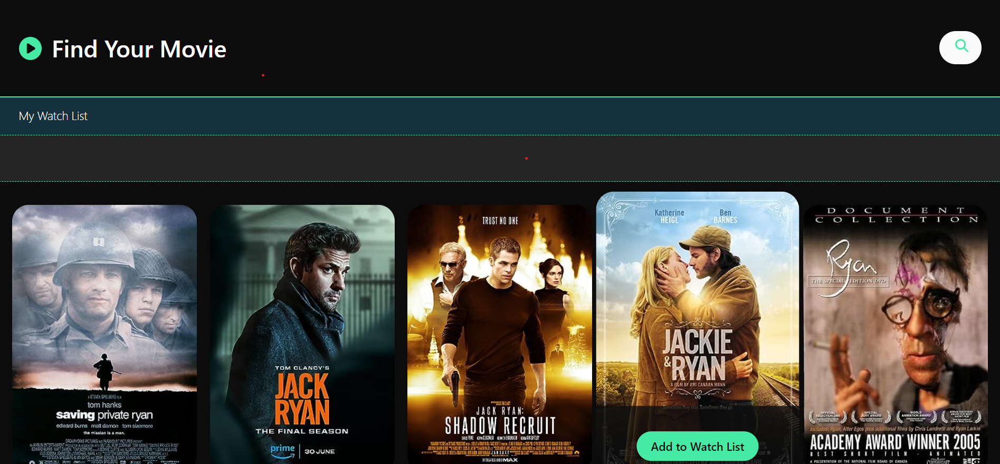
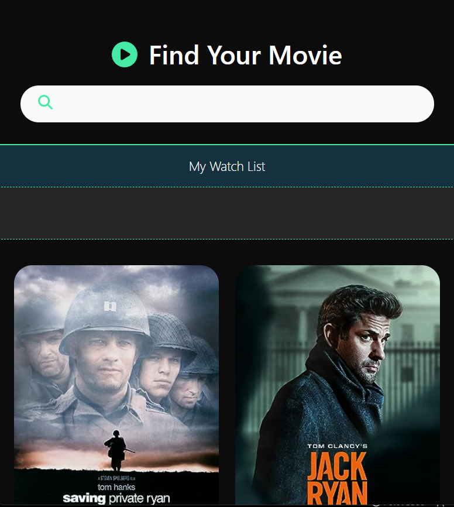
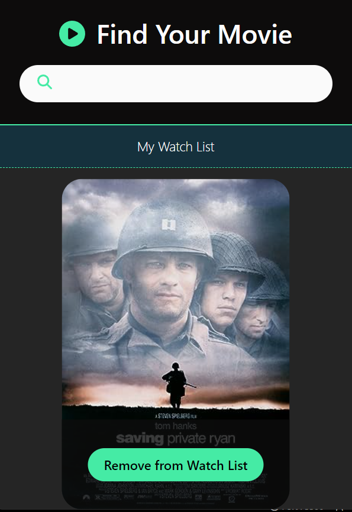
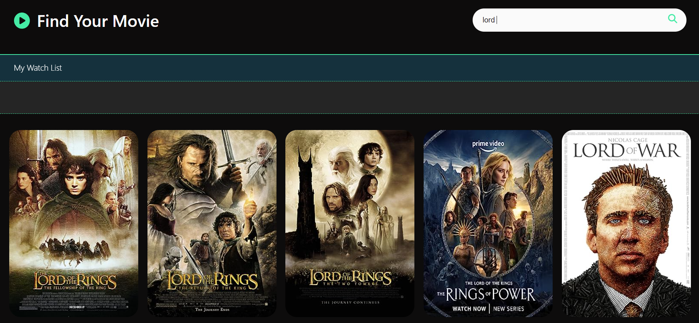

<h1 align="center">

 

 

 

</h1>

<h4 align="center">Find Your Movie</h4>

  

 

 

## Project Overview 🎉

A simple application to search and add to the list of favourite movies from the OMDb API database.

## Tech/framework used 🔧

| Tech                                                    | Description                              |
| ------------------------------------------------------- | ---------------------------------------- |
| [React](X)                           | Javascript library for creating user interfaces   |
| [Vite](X)                           | Development environment for creating modern web projects   |
| [Node.js](X)                           | Cross-platform, open-source JavaScript runtime   |

## Screenshots 📺

    

 

 

    

 

 

    

 

 

## Code Example/Issues 🔍

## Installation 💾

## Available scripts

| Command                   | Description                   |     |
| ------------------------- | ----------------------------- | --- |
| `npm run start`           | Open local server             |     |
| `npm run build`           | Create optimized build        |     |
| `npm run test`            | Run tests                     |     |

## Live 📍

## License 🔱
